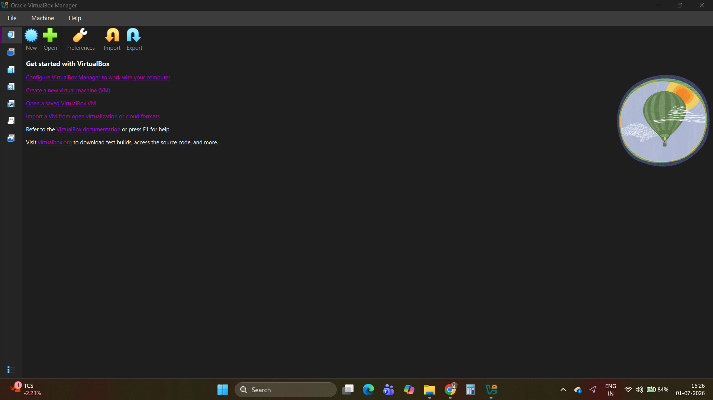
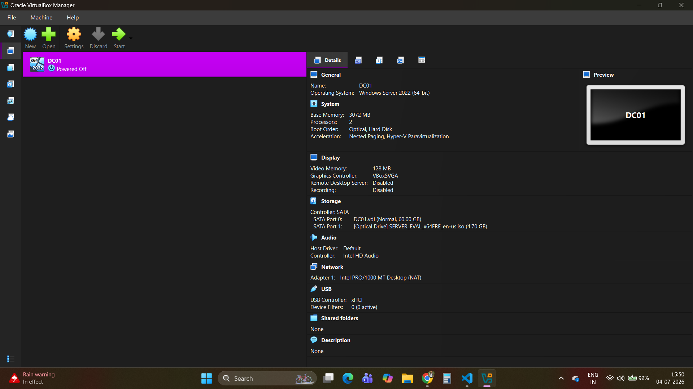
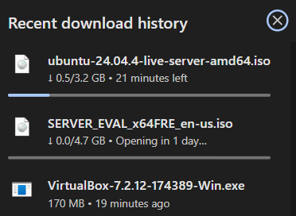
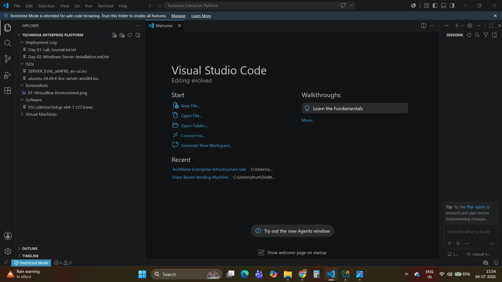

# Phase 01 – Environment Preparation

## Objective

Prepare the local development environment required to build the TechNova Enterprise Infrastructure Lab. This phase includes installing virtualization software, downloading operating system images, organizing the project structure, and creating the GitHub repository for documentation and version control.

---

# Host Machine

| Component | Details |
|-----------|---------|
| Laptop | Acer |
| Processor | Intel Core i5-1135G7 |
| RAM | 8 GB |
| Storage | SSD |
| Operating System | Windows 11 Home |

---

# Software Installed

The following software was installed before beginning the lab deployment:

- Oracle VirtualBox
- Visual Studio Code
- Git
- GitHub Desktop (optional)
- GitHub Repository

### Oracle VirtualBox Installation

Oracle VirtualBox was installed to host the virtual machines that make up the enterprise lab environment.

---

### VirtualBox Environment

After installation, VirtualBox was configured and verified to ensure the virtualization environment was ready for creating Windows Server and Ubuntu virtual machines.

---

# Operating Systems Downloaded

The required operating system images were downloaded before virtual machine deployment.

- Windows Server 2022 Standard Evaluation
- Ubuntu Server LTS

### ISO Downloads

Official ISO images were downloaded from Microsoft and Ubuntu for use throughout the project.

---

# GitHub Repository

A dedicated GitHub repository was created to document each implementation phase, maintain version control, and organize project files.

Repository structure includes:

- Documentation
- Diagrams
- Screenshots
- Scripts
- README
- LICENSE

### Project Structure

---

# Skills Learned

During this phase, the following skills were developed:

- Environment preparation
- Virtualization concepts
- Git & GitHub workflow
- Repository organization
- Enterprise documentation practices

---

# Deliverables

- ✅ Development environment prepared
- ✅ Oracle VirtualBox installed
- ✅ Project repository created
- ✅ ISO images downloaded
- ✅ Repository structure organized

---

# Next Phase

Deploy and configure the first Windows Server 2022 virtual machine (DC01), which will later become the Active Directory Domain Controller.