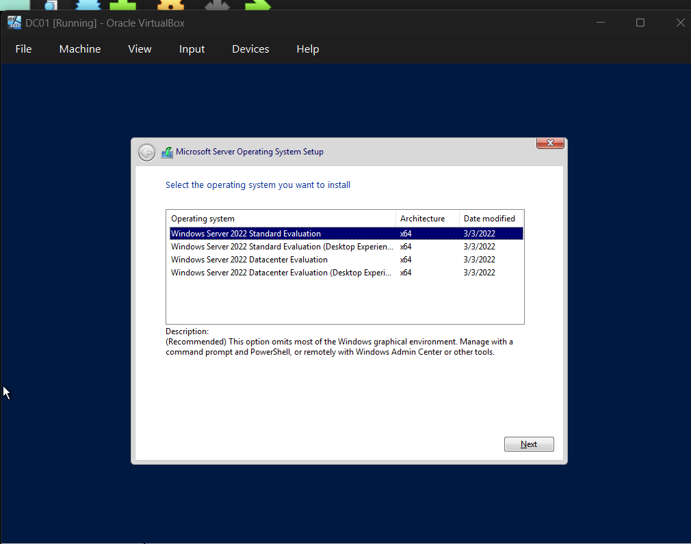
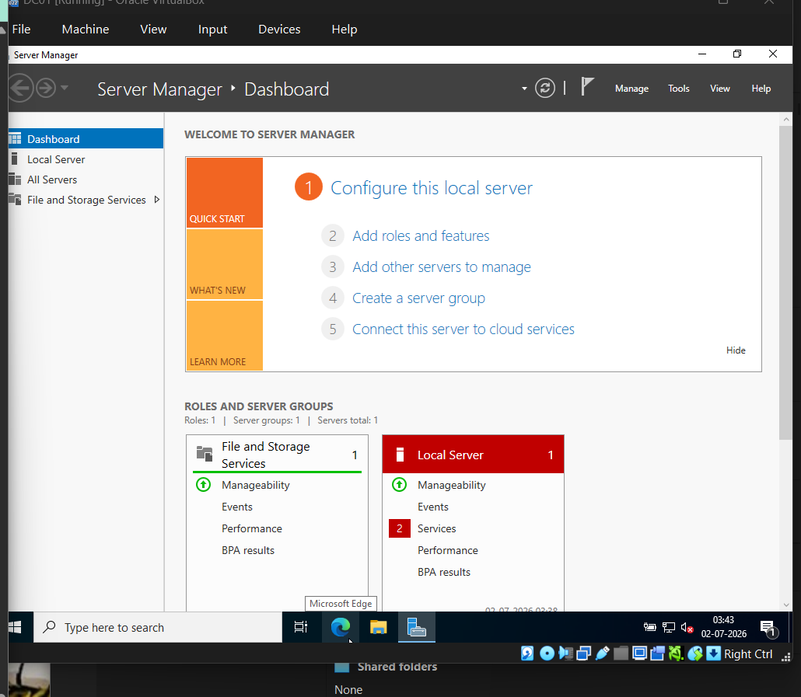
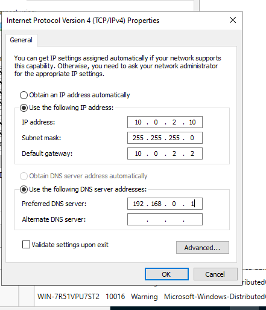

# Phase 02 – Windows Server Installation & Initial Configuration

## Objective

Deploy the first Windows Server 2022 virtual machine (DC01) and perform the initial configuration required before installing Active Directory Domain Services (AD DS).

---

# Virtual Machine Configuration

The DC01 virtual machine was created in Oracle VirtualBox with the following configuration.

| Setting | Value |
|----------|-------|
| Platform | Oracle VirtualBox |
| VM Name | DC01 |
| Operating System | Windows Server 2022 Standard Evaluation |
| Edition | Desktop Experience |
| RAM | 3072 MB |
| CPU | 2 vCPUs |
| Disk Type | VDI |
| Disk Allocation | Dynamically Allocated |
| Disk Size | 60 GB |

---

## Windows Server Installation

Windows Server 2022 Standard Evaluation (Desktop Experience) was successfully installed on the DC01 virtual machine.



---

# Initial Server Configuration

After the operating system installation, Server Manager was launched to verify the installation and prepare the server for further configuration.

Tasks completed:

- Verified successful installation
- Confirmed administrator login
- Renamed the server to **DC01**
- Configured the system time zone



---

# Network Configuration

To prepare the server for becoming a Domain Controller, a static IPv4 address was assigned.

| Setting | Value |
|----------|-------|
| Network Mode | NAT |
| IP Address | 10.0.2.10 |
| Subnet Mask | 255.255.255.0 |
| Default Gateway | 10.0.2.2 |
| Preferred DNS | 192.168.0.1 *(Temporary)* |

### Static IP Configuration

A static IP address ensures that clients can reliably locate essential services such as Active Directory and DNS.



---

# Server Configuration

| Setting | Value |
|----------|-------|
| Computer Name | DC01 |
| Time Zone | (UTC+05:30) Chennai, Kolkata, Mumbai, New Delhi |

---

# Lab Credentials

| Username | Password |
|----------|----------|
| Administrator | TechNova@2026 |

> ⚠️ These credentials are used only within this isolated lab environment. Never store production credentials in documentation.

---

# Key Concepts

## Windows Server vs Windows 11

Windows Server is designed to provide enterprise services such as Active Directory, DNS, DHCP, File Services, and centralized management. Windows 11 is intended primarily for end-user computing.

---

## Standard vs Datacenter

- **Standard Edition** – Suitable for most organizations, labs, and small to medium deployments.
- **Datacenter Edition** – Designed for highly virtualized and enterprise-scale environments with advanced features.

---

## Desktop Experience vs Server Core

- **Desktop Experience** provides a full graphical interface.
- **Server Core** provides a minimal installation managed primarily through PowerShell and remote administration.

---

## Why Use a Static IP Address?

Domain Controllers should always use static IP addresses so that authentication and DNS services remain consistently reachable throughout the network.

---

## Dynamic vs Fixed Virtual Disk

- Dynamic disks consume storage only as data is written.
- Fixed disks allocate the entire virtual disk size immediately.

Dynamic disks are ideal for home lab environments because they conserve physical storage.

---

## VDI vs VHD

- **VDI** – Native Oracle VirtualBox disk format.
- **VHD** – Microsoft Hyper-V virtual disk format.

---

# Tasks Completed

- ✅ Created the DC01 virtual machine
- ✅ Installed Windows Server 2022
- ✅ Configured the Administrator account
- ✅ Renamed the server to DC01
- ✅ Configured the system time zone
- ✅ Assigned a static IPv4 address
- ✅ Verified the configuration after reboot

---

# Current Architecture

```
Internet
     │
Home Router
     │
VirtualBox NAT
     │
DC01 (10.0.2.10)
```

---

# Skills Learned

During this phase, the following skills were developed:

- Windows Server deployment
- Virtual machine provisioning
- Static IP configuration
- Windows Server administration
- Enterprise infrastructure planning

---

# Deliverables

- ✅ Windows Server installed
- ✅ DC01 configured
- ✅ Static networking completed
- ✅ Server prepared for Active Directory installation

---

# Next Phase

Install the **Active Directory Domain Services (AD DS)** role, promote DC01 to a Domain Controller, create the **TECHNOVA.LOCAL** domain, and configure DNS services.