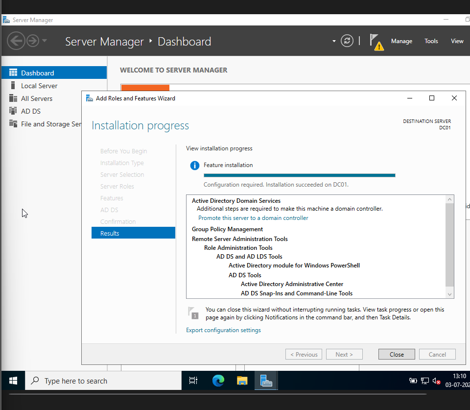
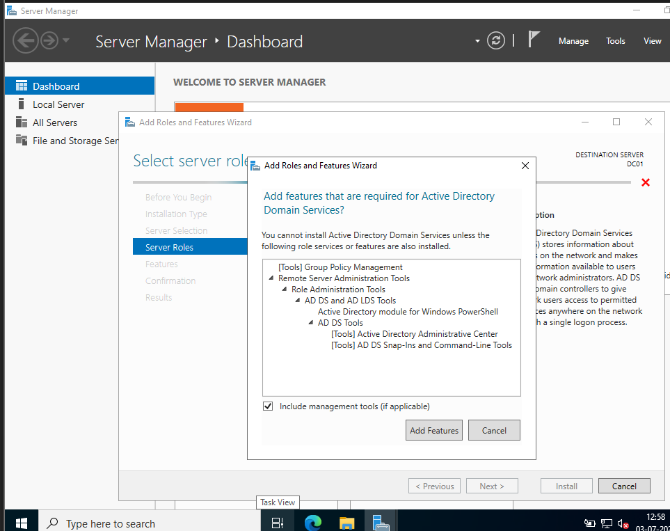
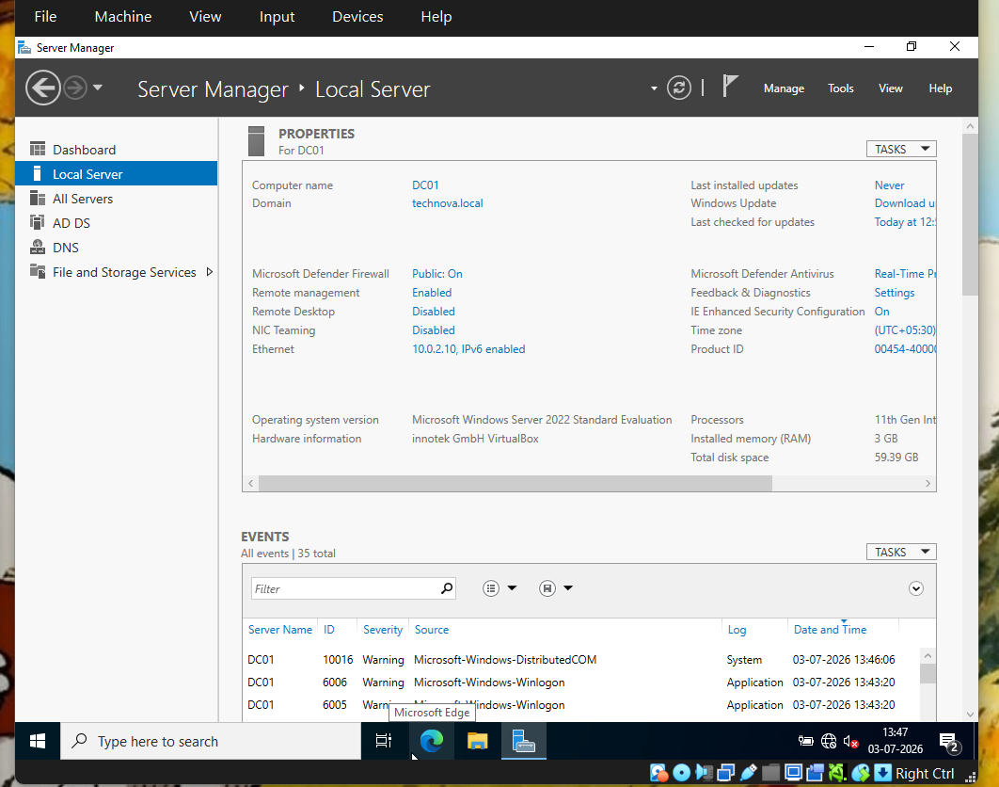
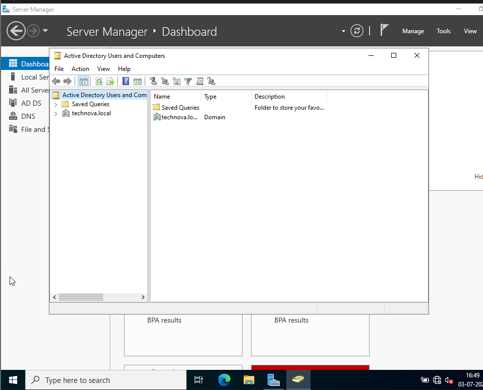

# Phase 03 – Active Directory Domain Services (AD DS) Installation

## Objective

Install the Active Directory Domain Services (AD DS) role on the Windows Server 2022 virtual machine and promote DC01 to the first Domain Controller by creating the **TECHNOVA.LOCAL** forest.

---

# Environment

| Component | Value |
|-----------|-------|
| Server Name | DC01 |
| Operating System | Windows Server 2022 Standard |
| Domain Name | TECHNOVA.LOCAL |
| IP Address | 192.168.100.10 |

---

# Active Directory Role Installation

The **Active Directory Domain Services (AD DS)** role was installed using Server Manager. During installation, the DNS Server role was automatically selected because Active Directory depends on DNS for locating domain services.

Tasks performed:

- Installed Active Directory Domain Services
- Installed DNS Server role
- Prepared the server for Domain Controller promotion

---

# Domain Controller Promotion

After the AD DS role installation completed, the server was promoted to the first Domain Controller of a new forest.

Configuration performed:

- Created a new forest
- Configured the domain name **TECHNOVA.LOCAL**
- Configured the Directory Services Restore Mode (DSRM) password
- Completed prerequisite validation
- Restarted the server after promotion

---

# Domain Creation Verification

After the server restarted, the new Active Directory domain was successfully created.

Verification included:

- TECHNOVA.LOCAL domain available
- Active Directory services initialized successfully
- Domain Controller operational

---

# Deployment Verification

Server Manager confirmed that the Active Directory deployment completed successfully.

Verified components:

- Active Directory Domain Services
- DNS Server
- Successful Domain Controller promotion
- No deployment errors reported

---

# Key Concepts

## What is Active Directory?

Active Directory is Microsoft's centralized directory service used to authenticate users, manage computers, enforce security policies, and organize network resources within a Windows domain.

---

## Why is DNS Required?

DNS is a mandatory dependency for Active Directory because domain-joined devices locate Domain Controllers through DNS service records.

---

## What is a Domain Controller?

A Domain Controller stores the Active Directory database and provides authentication, authorization, and directory services to all devices joined to the domain.

---

# Skills Learned

During this phase, the following skills were developed:

- Active Directory installation
- Domain Controller deployment
- Forest creation
- DNS integration
- Enterprise identity management

---

# Deliverables

- ✅ Active Directory Domain Services installed
- ✅ DNS Server role installed
- ✅ Domain Controller promoted successfully
- ✅ TECHNOVA.LOCAL forest created
- ✅ Active Directory deployment verified

---

# Next Phase

Configure DNS, verify forward and reverse name resolution, and validate that clients can successfully locate domain services through DNS.