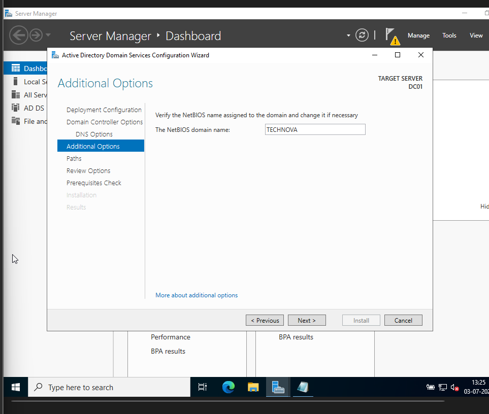
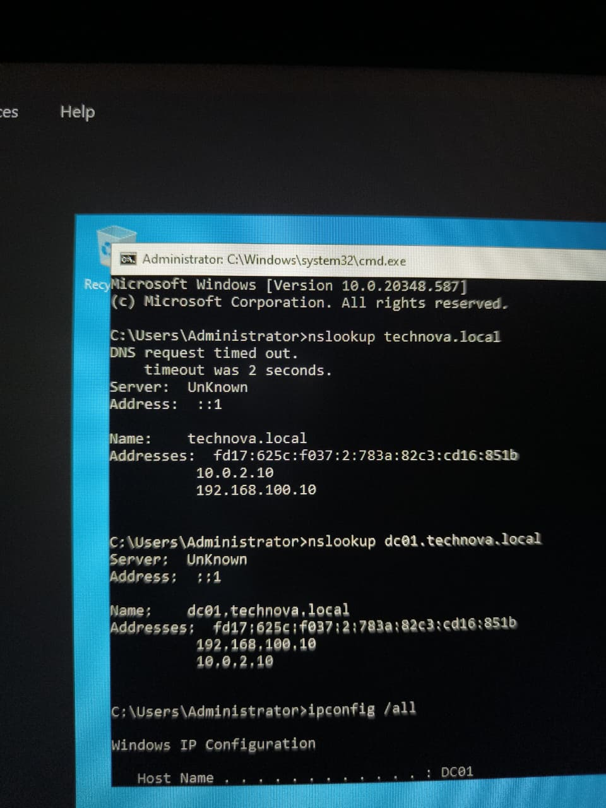

# Phase 04 – DNS Configuration

## Objective

Verify and validate the Domain Name System (DNS) configuration required for the proper operation of **Active Directory** within the **TECHNOVA.LOCAL** domain.

---

# DNS Configuration

After promoting **DC01** to a Domain Controller, the DNS Server role was automatically configured alongside **Active Directory Domain Services (AD DS)**.

The following components were verified:

- Forward Lookup Zone
- Reverse Lookup Zone
- Host (A) Records
- Service (SRV) Records
- DNS Server functionality

---

# DNS Manager Verification

The DNS Manager console was used to verify that the required DNS zones and records were successfully created during the Domain Controller promotion.

Verified components:

- Forward Lookup Zone
- Reverse Lookup Zone
- DNS Server status



---

# DNS Name Resolution Test

The DNS configuration was validated using command-line tools.

Commands executed:

```powershell
nslookup
Resolve-DnsName TECHNOVA.LOCAL
ping DC01
```

Successful responses confirmed that DNS was correctly resolving hostnames and domain information.



---

# Key Concepts

## Why is DNS Important?

**Active Directory** relies entirely on DNS to locate Domain Controllers and directory services across the network.

Without a properly functioning DNS server:

- Clients cannot locate **DC01**
- Domain authentication fails
- Group Policy processing fails
- Domain joining is unsuccessful

---

## Forward Lookup Zone

A Forward Lookup Zone translates hostnames into IP addresses.

Example:

```
DC01 → 192.168.100.10
```

---

## Reverse Lookup Zone

A Reverse Lookup Zone translates IP addresses back into hostnames.

Example:

```
192.168.100.10 → DC01
```

---

## SRV Records

Service (SRV) records allow domain-joined devices to discover services such as:

- Active Directory
- Kerberos
- LDAP
- Global Catalog

These records are automatically created when **DC01** is promoted to a Domain Controller.

---

# Skills Learned

During this phase, the following skills were developed:

- DNS administration
- Forward and Reverse Lookup Zones
- Name resolution troubleshooting
- Active Directory DNS integration
- DNS verification using PowerShell

---

# Deliverables

- ✅ DNS Server verified
- ✅ Forward Lookup Zone validated
- ✅ Reverse Lookup Zone validated
- ✅ Host (A) records verified
- ✅ SRV records confirmed
- ✅ DNS name resolution tested successfully

---

# Next Phase

Create the Organizational Unit (OU) structure, configure security groups, and begin managing users within the **TECHNOVA.LOCAL** domain.