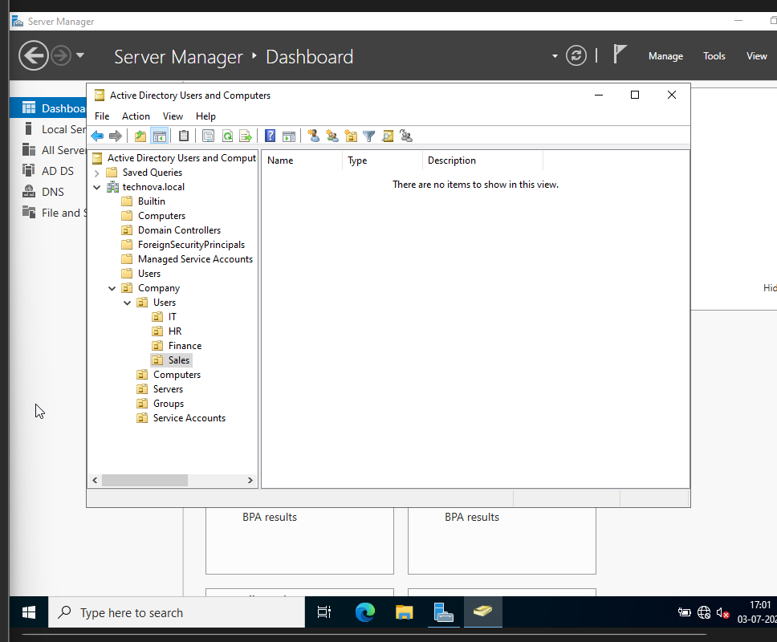
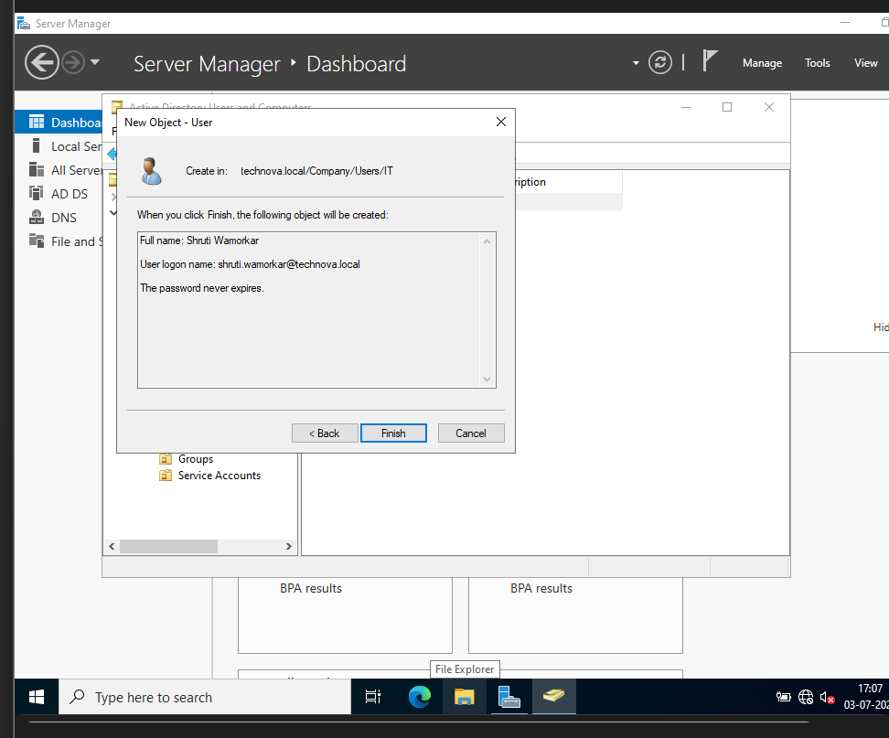
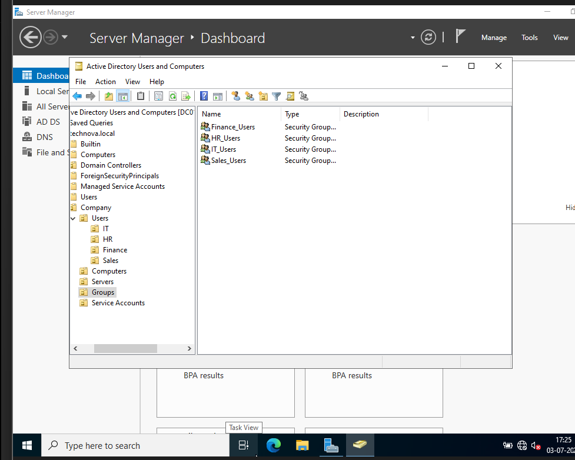

# Phase 05 - Organizational Units and Users

## Objective

Design and implement an enterprise-style **Active Directory** organizational structure by creating **Organizational Units (OUs)**, domain user accounts, and security groups. This structure provides a scalable foundation for centralized administration, delegation, and future **Group Policy** implementation.

---

## Environment

- **Server:** **DC01**
- **Operating System:** Windows Server 2022
- **Domain:** **TECHNOVA.LOCAL**
- **Management Console:** **Active Directory Users and Computers (ADUC)**

---

## Implementation

### 1. Created Organizational Units (OUs)

A logical OU hierarchy was created to separate users, computers, and administrative resources according to business departments.

The following Organizational Units were created:

- IT
- HR
- Finance
- Sales
- Servers
- Workstations

This structure improves administration, simplifies policy management, and allows permissions to be delegated without affecting the entire domain.

---

### 2. Created Domain User Accounts

Sample user accounts were created within their respective departmental Organizational Units.

Each user was configured with:

- Username
- Initial password
- Password change requirement at first logon
- Department-specific placement

This simulates a real enterprise environment where users are organized according to their department.

---

### 3. Created Security Groups

Security groups were created for each department to simplify permission management.

Examples include:

- IT Users
- HR Users
- Finance Users
- Sales Users

Users were assigned to the appropriate security groups according to their department.

Using security groups instead of assigning permissions directly to individual users follows Microsoft's recommended Active Directory administration practices.

---

## Verification

The Active Directory configuration was verified by confirming:

- Organizational Units were created successfully.
- User accounts were located in the correct Organizational Units.
- Security groups were created successfully.
- Users were assigned to the appropriate security groups.

The configuration was verified using **Active Directory Users and Computers (ADUC)**.

---

## Key Concepts

- **Organizational Units (OUs)** provide logical separation of resources within a domain.
- **Security Groups** simplify access control by assigning permissions to groups instead of individual users.
- Department-based organization improves scalability and simplifies future **Group Policy** deployment.
- Proper Active Directory design reduces administrative overhead in enterprise environments.

---

## Skills Learned

- Creating Organizational Units
- Managing Active Directory Users
- Creating Security Groups
- Assigning Group Membership
- Enterprise Active Directory Organization
- Active Directory Administration

---

## Deliverables

✔ Enterprise OU hierarchy

✔ Departmental user accounts

✔ Security group structure

✔ User-to-group assignments

---

## Next Phase

The next phase focuses on implementing **Group Policy Objects (GPOs)** to centrally manage user and computer configurations across the **TECHNOVA.LOCAL** domain.