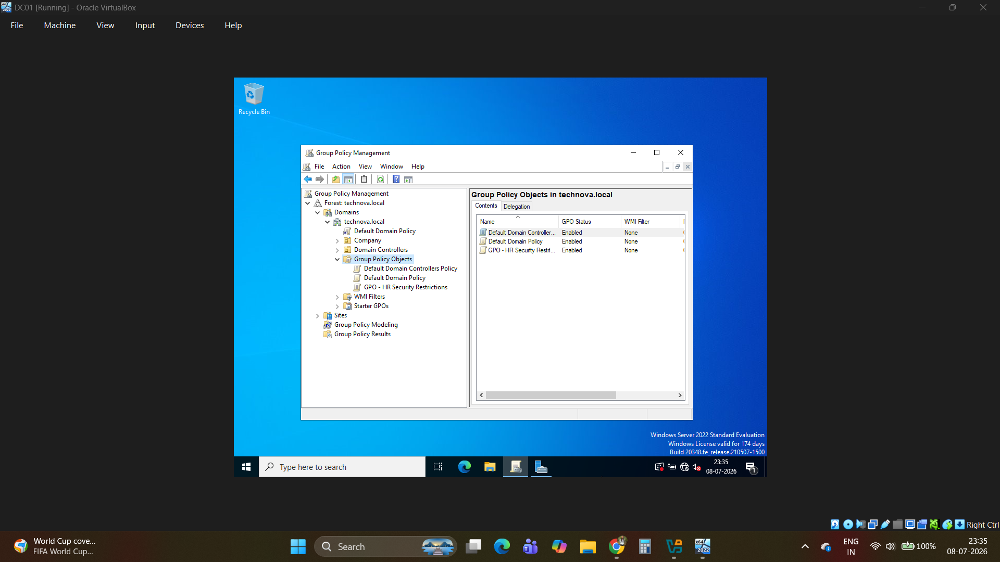
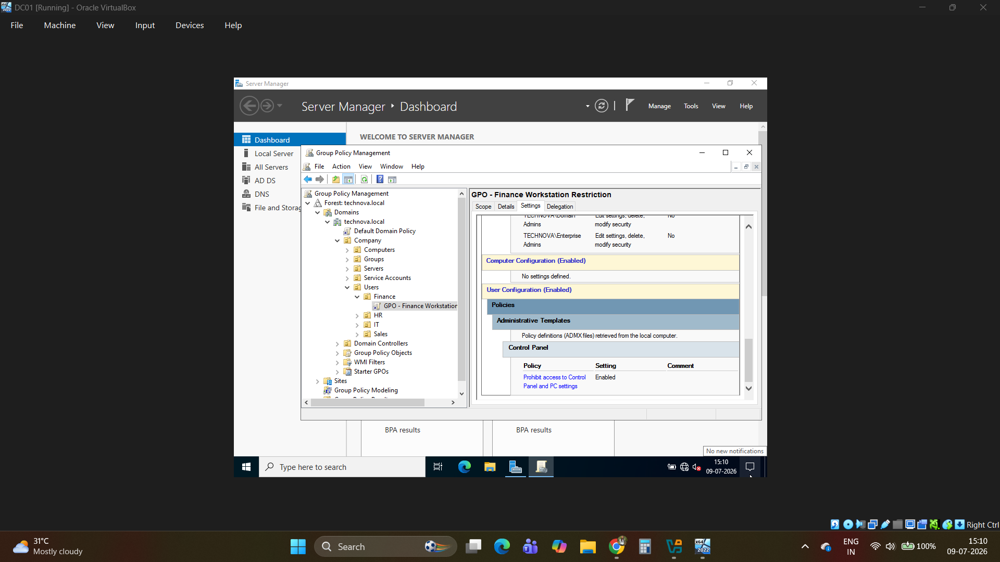
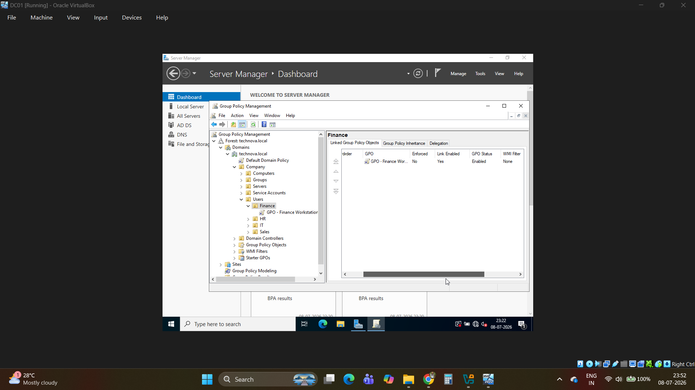

# Phase 06 - Group Policy Management

## Objective

Implement **Group Policy Objects (GPOs)** to centrally manage user and computer configurations within the **TECHNOVA.LOCAL** domain. This phase demonstrates how enterprise administrators enforce security settings, standardize user environments, and simplify system administration through centralized policy management.

---

## Environment

- **Server:** **DC01**
- **Operating System:** Windows Server 2022
- **Domain:** **TECHNOVA.LOCAL**
- **Management Console:** **Group Policy Management (GPMC)**

---

## Implementation

### 1. Created a Group Policy Object (GPO)

A new **Group Policy Object (GPO)** was created using the **Group Policy Management Console (GPMC)**.

This GPO serves as a centralized configuration object that can be linked to Organizational Units (OUs) to automatically apply settings to users and computers.



---

### 2. Configured Group Policy Settings

The Group Policy was configured with common enterprise administrative settings, including:

- Password Policy
- Account Lockout Policy
- Desktop Wallpaper Configuration
- Control Panel Restrictions

These policies help improve security, enforce organizational standards, and reduce unauthorized user modifications.



---

### 3. Linked the GPO to Organizational Units

After configuration, the GPO was linked to the appropriate Organizational Units so that the policy would automatically apply to users within those departments.

This demonstrates how different policies can be targeted to specific areas of an organization without affecting the entire domain.



---

## Verification

Policy deployment was verified by updating Group Policy on the client using:

```powershell
gpupdate /force
```

Verification confirmed that:

- The GPO was successfully linked.
- Policy settings were applied.
- Administrative restrictions were enforced.
- The configured settings became active after Group Policy refresh.

---

## Key Concepts

- **Group Policy Objects (GPOs)** provide centralized management of Windows systems.
- Policies can be linked to specific **Organizational Units (OUs)** for targeted administration.
- Security settings can be enforced consistently across an enterprise environment.
- Group Policy simplifies administration while ensuring compliance with organizational standards.

---

## Skills Learned

- Creating Group Policy Objects
- Configuring Security Policies
- Password Policy Management
- Account Lockout Configuration
- Desktop Environment Management
- Linking GPOs to Organizational Units
- Group Policy Administration
- Verifying Policy Deployment

---

## Deliverables

✔ Created a Group Policy Object

✔ Configured enterprise security policies

✔ Linked GPO to Organizational Units

✔ Verified successful policy deployment using **gpupdate**

---

## Next Phase

The next phase focuses on deploying an **Ubuntu Server** virtual machine to expand the lab into a mixed Windows and Linux enterprise environment.