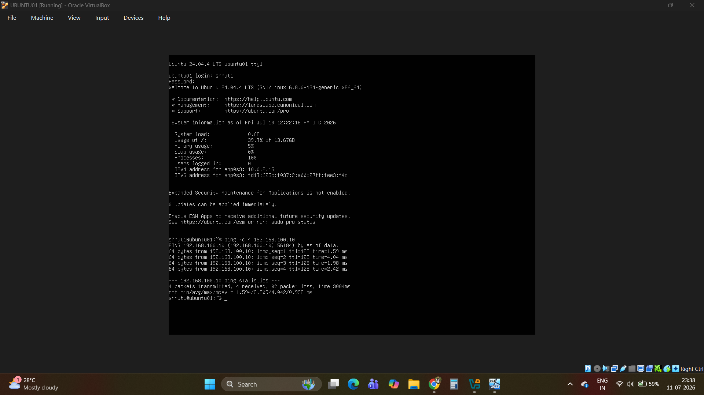
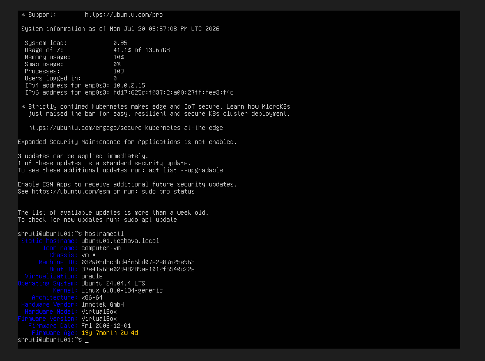
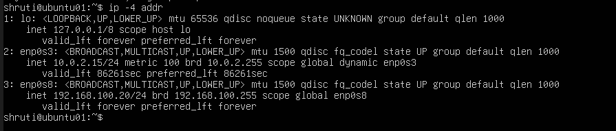
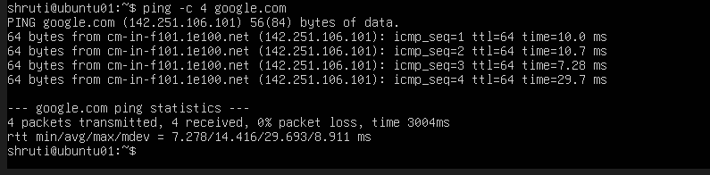

# Phase 07 – Ubuntu Server Installation

## Objective

Deploy **Ubuntu Server 24.04 LTS** as an enterprise Linux server within the **TECHNOVA.LOCAL** lab environment. Configure networking, assign a static IP address, and verify connectivity in preparation for Active Directory domain integration.

---

## Environment

| Component | Value |
|-----------|-------|
| Virtualization Platform | Oracle VirtualBox |
| Operating System | Ubuntu Server 24.04 LTS |
| Server Name | **UBUNTU01** |
| Domain | **TECHNOVA.LOCAL** |
| Network Adapter 1 | NAT |
| Network Adapter 2 | Internal Network |
| Static IP Address | 192.168.100.20/24 |
| DNS Server | 192.168.100.10 (**DC01**) |

---

## Prerequisites

- **DC01** configured as the Domain Controller
- **Active Directory Domain Services (AD DS)** installed
- **DNS Server** operational
- Internal Network configured in VirtualBox
- Ubuntu Server 24.04 LTS ISO downloaded

---

## Implementation

### 1. Created the Ubuntu Virtual Machine

A new virtual machine named **UBUNTU01** was created using Oracle VirtualBox.

Resources allocated included:

- Virtual CPU
- Memory (RAM)
- Virtual Hard Disk
- Ubuntu Server 24.04 LTS installation ISO



---

### 2. Installed Ubuntu Server

The Ubuntu Server installation wizard was completed by configuring:

- Language
- Keyboard Layout
- Storage
- Administrator Account
- Hostname (**ubuntu01**)

After installation, the server booted successfully into Ubuntu Server.



---

### 3. Configured Network Settings

The server was configured with two network adapters.

**Adapter 1 (NAT)**

- Internet connectivity
- Package downloads and updates

**Adapter 2 (Internal Network)**

- Communication with **DC01**
- Enterprise lab network connectivity

---

### 4. Assigned a Static IP Address

Network settings were configured using **Netplan**.

Configuration included:

- Static IP Address: **192.168.100.20/24**
- DNS Server: **192.168.100.10**
- Search Domain: **TECHNOVA.LOCAL**

The configuration was applied using:

```bash
sudo netplan apply
```

Network settings were verified with:

```bash
ip addr
ip route
resolvectl status
```



---

### 5. Verified Network Connectivity

Connectivity tests confirmed successful communication with:

- **DC01**
- DNS Server
- Internal Network
- Internet

This verified that the Ubuntu server was correctly integrated into the lab network and was ready for domain integration.



---

## Verification

The deployment was successfully verified by confirming:

- Ubuntu Server installed successfully
- Hostname configured correctly
- Static IP address assigned
- DNS server configured
- Internal network communication established
- Internet connectivity available

---

## Key Concepts

- Linux Server Deployment
- Netplan Network Configuration
- Static IP Addressing
- DNS Configuration
- Dual-Network Architecture
- Enterprise Virtualization
- Network Verification

---

## Skills Learned

- Installing Ubuntu Server
- Virtual Machine Deployment
- Linux Network Configuration
- Netplan Administration
- Static IP Configuration
- DNS Configuration
- Enterprise Network Verification
- Linux System Administration

---

## Deliverables

✔ Ubuntu Server 24.04 LTS deployed

✔ Static IP configuration completed

✔ DNS configured

✔ Dual-network adapters configured

✔ Connectivity verified

---

## Next Phase

The next phase focuses on joining **UBUNTU01** to the **TECHNOVA.LOCAL** Active Directory domain using **realmd**, **SSSD**, and Kerberos authentication.