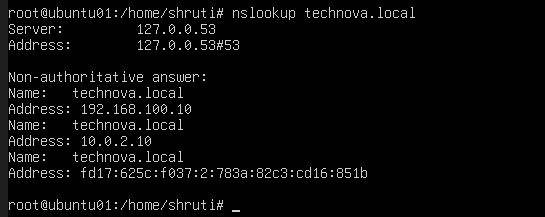
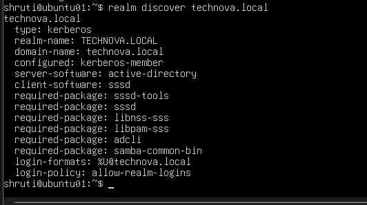
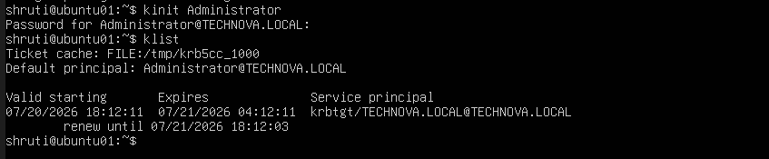
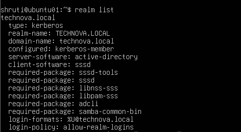
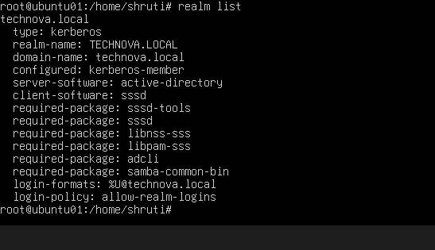
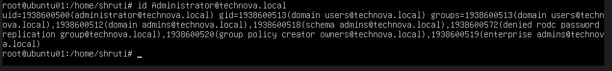
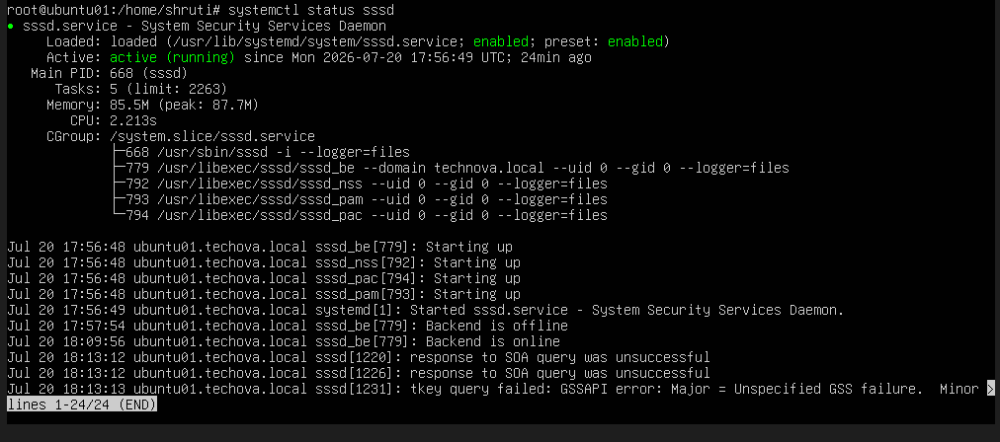
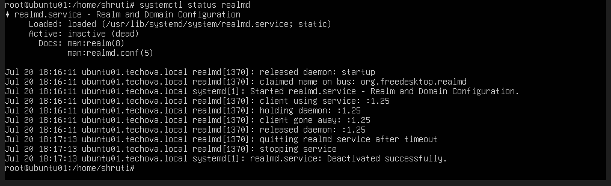
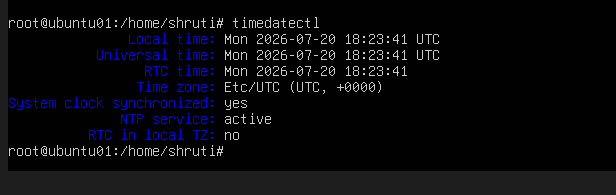

# Phase 08 – Ubuntu Active Directory Integration

## Objective

Integrate **UBUNTU01** with the **TECHNOVA.LOCAL** Active Directory domain to enable centralized authentication using **Kerberos**, **SSSD**, and **realmd**. This allows Linux systems to authenticate against Windows Active Directory, providing a unified identity management solution within the enterprise lab.

---

## Environment

| Component | Value |
|-----------|-------|
| Operating System | Ubuntu Server 24.04 LTS |
| Server Name | **UBUNTU01** |
| Domain Controller | **DC01** |
| Domain | **TECHNOVA.LOCAL** |
| Ubuntu IP Address | 192.168.100.20 |
| Domain Controller IP | 192.168.100.10 |

---

## Prerequisites

- **DC01** configured as an Active Directory Domain Controller
- DNS configured correctly
- Ubuntu Server installed
- Static IP address configured
- Network connectivity verified
- Time synchronization functioning correctly

---

## Implementation

### 1. Installed Required Packages

The required packages for Active Directory integration were installed.

```bash
sudo apt update

sudo apt install realmd sssd sssd-tools adcli samba-common-bin oddjob oddjob-mkhomedir packagekit krb5-user
```

These packages provide:

- Active Directory discovery
- Kerberos authentication
- SSSD identity services
- Domain joining utilities

---

### 2. Verified DNS Configuration

The Ubuntu server was configured to use **DC01** as its DNS server.

Initially, the DNS search domain was missing, preventing Active Directory discovery.

Netplan was updated to include:

```yaml
search:
  - technova.local
```

The configuration was applied using:

```bash
sudo netplan apply
```

DNS resolution was verified before proceeding.



---

### 3. Verified Active Directory Discovery

Active Directory discovery was performed using:

```bash
realm discover technova.local
```

The command successfully identified:

- Realm Name
- Domain Name
- Kerberos Realm
- Active Directory Server
- Required integration packages



---

### 4. Verified Kerberos Authentication

Kerberos authentication was tested by requesting a Ticket Granting Ticket (TGT).

```bash
kinit Administrator

klist
```

Successful authentication confirmed that Kerberos communication with the domain controller was functioning correctly.



---

### 5. Joined Ubuntu to Active Directory

The Ubuntu server was joined to the Active Directory domain.

```bash
sudo realm join -U Administrator technova.local
```

After entering the Domain Administrator credentials, **UBUNTU01** successfully became a member of the **TECHNOVA.LOCAL** domain.



---

### 6. Verified Domain Membership

Domain membership was confirmed using:

```bash
realm list
```

Verification confirmed:

- Domain membership
- Kerberos authentication
- Login policy
- SSSD configuration



---

### 7. Verified Domain User Resolution

Domain user information was retrieved successfully.

```bash
id Administrator@technova.local

getent passwd 'TECHNOVA\Administrator'
```

The returned information confirmed that Ubuntu could query users directly from Active Directory.



---

### 8. Verified SSSD Service

The SSSD service was verified.

```bash
sudo systemctl status sssd
```

The service was confirmed to be:

- Active
- Running
- Communicating successfully with Active Directory



---

### 9. Verified Authentication Services

Additional verification confirmed that authentication services were operating correctly and that domain-based logins were available.



---

### 10. Verified Time Synchronization

Time synchronization between **UBUNTU01** and the domain controller was verified.

Accurate system time is essential for successful Kerberos authentication because Kerberos tickets are time-sensitive.



---

## Verification

The Active Directory integration was successfully verified by confirming:

- DNS resolution
- Active Directory discovery
- Kerberos authentication
- Successful domain join
- Domain membership
- Domain user resolution
- SSSD service operation
- Authentication services
- Time synchronization

The Ubuntu server is now fully integrated with the **TECHNOVA.LOCAL** Active Directory domain.

---

## Challenges Faced

### Issue

Initially, the command:

```bash
realm discover technova.local
```

returned:

```
No such realm found
```

### Root Cause

The Ubuntu server was missing the DNS search domain in the Netplan configuration.

### Resolution

The following configuration was added:

```yaml
search:
  - technova.local
```

After applying the configuration:

```bash
sudo netplan apply
```

Active Directory discovery completed successfully, allowing the server to join the domain.

---

## Key Concepts

- Active Directory Integration
- Kerberos Authentication
- SSSD Identity Services
- Linux Domain Membership
- DNS Resolution
- Enterprise Authentication
- Time Synchronization

---

## Skills Learned

- Integrating Linux with Active Directory
- Configuring Kerberos
- Using realmd
- Configuring SSSD
- Domain Authentication
- Linux Identity Management
- Enterprise DNS Configuration
- Cross-Platform System Administration

---

## Deliverables

✔ Ubuntu integrated with Active Directory

✔ Kerberos authentication verified

✔ Domain membership established

✔ Domain users resolved successfully

✔ SSSD configured and operational

✔ Enterprise authentication validated

---

## Next Phase

The next phase focuses on deploying a **Windows 11 Enterprise** client and joining it to the **TECHNOVA.LOCAL** domain to complete the enterprise infrastructure lab.