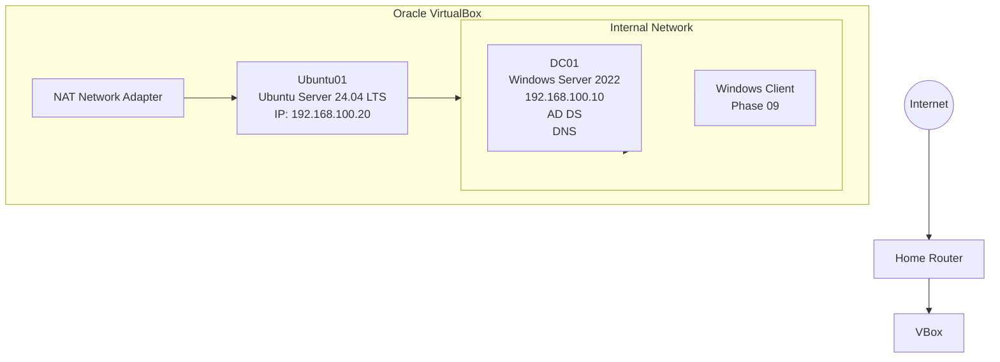

# TechNova Enterprise Infrastructure Lab

## Overview

This project demonstrates the deployment of a complete enterprise infrastructure using Windows Server 2022, Ubuntu Server 24.04, Active Directory Domain Services, DNS, DHCP, Group Policy, Linux administration, and VirtualBox.

The objective is to simulate a production enterprise environment while documenting every configuration step, troubleshooting activity, and best practice.

---

## Technologies Used

- Windows Server 2022
- Ubuntu Server 24.04
- Active Directory Domain Services
- DNS
- DHCP
- Group Policy
- VirtualBox
- PowerShell
- Bash
- VS Code
- Git & GitHub

---

## Infrastructure
## Infrastructure

## Documentation

- Phase 01 – Environment Preparation
- Phase 02 – Windows Server Installation
- Phase 03 – Active Directory Installation
- Phase 04 – DNS Configuration
- Phase 05 – Organizational Units & Users
- Phase 06 – Group Policy
- Phase 07 – Ubuntu Server Installation
- Phase 08 – Ubuntu Active Directory Integration
- Phase 09 – Windows Client Domain Join
- Phase 10 – File Server
- Phase 11 – DHCP Server
- Phase 12 – Backup & Recovery

---

## Skills Demonstrated

- Active Directory Administration
- DNS Management
- Linux Administration
- Windows Server Administration
- Kerberos Authentication
- Identity Management
- Group Policy
- Virtualization
- Infrastructure Documentation
- Troubleshooting
- Git Version Control

---

## Current Progress

- [x] Environment Preparation
- [x] Windows Server Installation
- [x] Active Directory Installation
- [x] DNS Configuration
- [x] Organizational Units
- [x] Group Policy
- [x] Ubuntu Installation
- [x] Ubuntu Domain Join
- [ ] Windows Client Join
- [ ] File Server
- [ ] DHCP
- [ ] Backup
